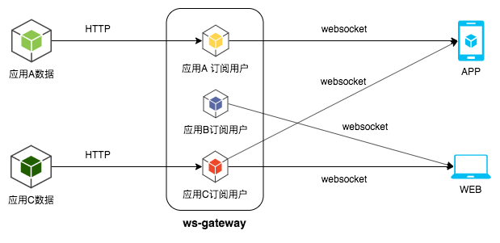

# ws-gateway
`ws-gateway`是一个`websocket`网关服务器，客户端经过认证连接到`ws-gateway`，并订阅所需`APP`的数据，当`APP`需要推送数据时，
只需要把数据通过`HTTP`请求发送给`ws-gateway`，`ws-gateway`会主动把消息推送到对应的客户端。数据流向图如下所示：




### 启动 websocket 网关服务器
```sh
go build
./ws-gateway
```

### 数据格式
客户端与服务端之间通过纯文本交互，文本数据格式为`JSON`字符串。服务器响应的数据格式如下：
```json
{
    "app":"gateway",
    "member_id":-1,
    "text":"{\"code\":200,\"message\":\"hello 123456\"}"
}
```

- `app` 字段表示推送本条消息数据的应用
- `member_id` 字段表示接收消息用户的`member_id`，非私有应用消息`member_id`均为`-1`
- `text` 字段是应用推送的具体消息数据

### websocket 客户端连接说明

#### 认证
由于需要认证客户端，在`websocket`连接成功之后，要首先发送一个认证相关的`JSON`数据，
且必须在`10s`内完成发送，否则服务端响应缺少认证信息的响应消息，然后服务端断开连接。认证失败的用户会被视为匿名用户。

认证请求数据消息如下所示：
```json
{
    "member_id":123456,
    "token":"654321"
}
```

匿名用户认证请求消息格式如下所示：
```json
{
    "member_id":-1,
    "token":""
}
```

匿名用户认证响应消息格式如下：
```json
{
    "app":"gateway",
    "member_id":-1,
    "text":"{\"code\":200,\"message\":\"hello stranger\"}"
}
```

认证成功后的响应消息格式如下所示：
```json
{
    "app":"gateway",
    "member_id":-1,
    "text":"{\"code\":200,\"message\":\"hello 123456\"}"
}
```

认证失败后的响应消息格式如下所示：
```json
{
    "app":"gateway",
    "member_id":-1,
    "text":"{\"code\":401,\"message\":\"unauthorized\"}"
}
```

缺少认证的响应消息格式如下所示：
```json
{
    "app":"gateway",
    "member_id":-1,
    "text":"{\"code\":400,\"message\":\"missing auth message\"}"
}
```

#### 订阅APP消息
客户端连接认证成功后，需要主动订阅相关`APP`的数据，才能收到相关`APP`的数据推送。

订阅请求消息格式如下：
```json
{
    "app":"match"
}
```

订阅成功响应消息格式如下：
```json
{
    "app":"gateway",
    "member_id":-1,
    "text":"{\"code\":200,\"message\":\"subscribe match success\"}"
}
```

订阅失败响应消息格式如下：
```json
{
    "app":"gateway",
    "member_id":-1,
    "text":"{\"code\":400,\"message\":\"bad subscribe message\"}"
}
```

订阅没有权限的`APP`响应消息如下：
```json
{ "app":"gateway",
    "member_id":-1,
    "text":"{\"code\":200,\"message\":\"subscribe im forbidden\"}"
}
```

### 消息推送
发送消息推送请求给`websocket`网关服务器，服务器根据`APP`来进行消息推送。

使用`cURL`发送消息推送请求
```sh
curl -H "Content-type: application/json" -X POST 'http://localhost:5000/push' -d '
{
    "app":"match",
    "member_id":-1,
    "text":"{\"hello\":\"world\"}"
}
'
```

### 查看 websocket 连接数
状态服务器监听在`127.0.0.1:6000`地址。

使用`cURL`查看状态
```sh
curl 'http://127.0.0.1:6000/stat'
match 1
im 1
chat 1
```